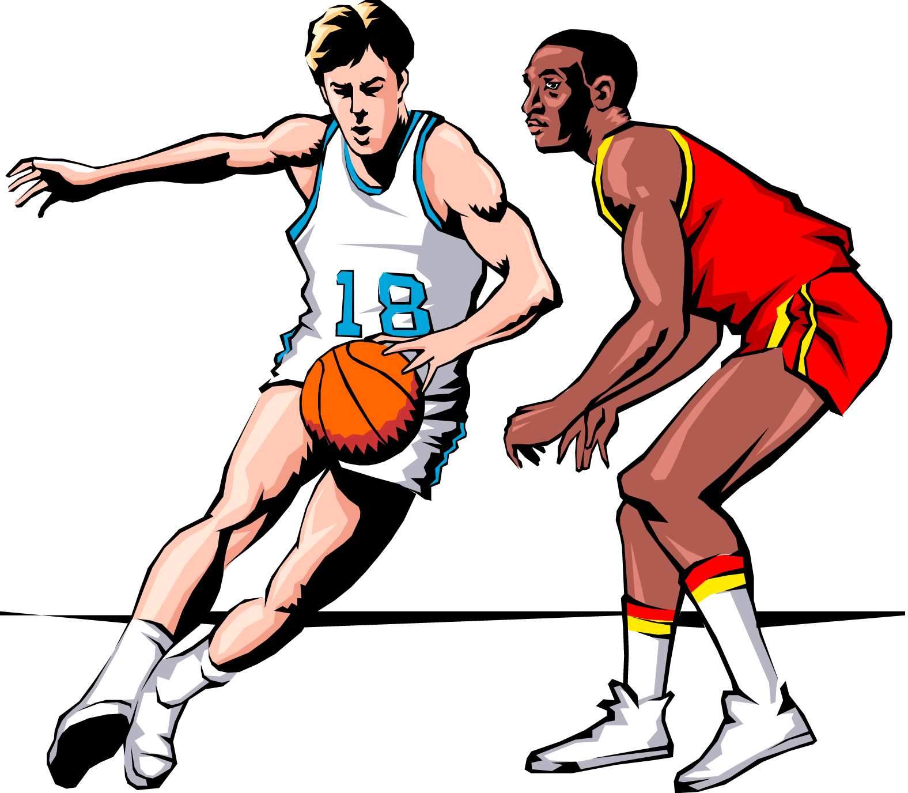
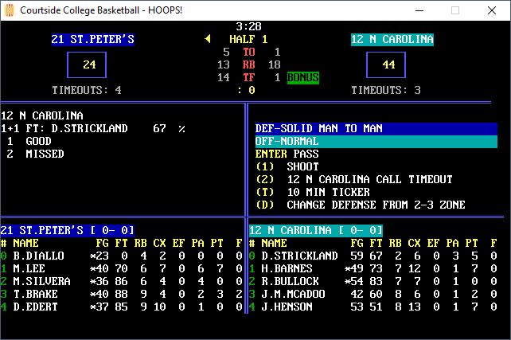

# LH Games Courtside College Basketball #

### Game Description ###
Courtside College Basketball is a fast-paced simulator, allowing you to recreate original seasons or conjure up the tournament match of your dreams! Several styles of offense and defense give you the choice to strategize each moment. Save and compile stats, input your own teams or draft or trade players. Play against a friend, against the computer, or watch simulations at your own pace. Teams and players are rated in several categories using real-world stats, so the outcomes are not only possible - they feel real.

**· Each player contributes as they did in real life! · Stats Compiler · You determine starting lineup, substitutions, shot selection, passing, offensive and defensive styles of play and more! ·**

### About Project ###
With permission from Lance Haffner himself, this effort is being made to bring his original source code from the DOS world into the modern world. This is due in part to cross-platform compilers for BASIC such as [QB64pe](https://github.com/QB64-Phoenix-Edition/QB64pe). But this effort aims to restore his original vision for a cross-platform sports sim empire, while also opening the door for improvements to accuracy, usability and portability.

Several functions from the original code were linked from Crescent Software libraries. To make a faster route to compilation of the code, most of these were re-written as copycats (where code was not available or ASM routines were used). Functions which relied on packing color into 1 byte were updated to use FG/BG separately. This helped to reduce the number of 'helper' routines as possible.

### About LH Games ###
Since 1983 Lance Haffner Games has been publishing the finest quality text-based computer sports games. Recognized for their statistical accuracy; national media outlets have used Haffner's games to play matchups between great teams of the century. The Ft. Worth Star-Telegram, WTVF-TV (Nashville), The Nashville Banner, and ESPN have used Lance Haffner's games to simulate real and "what if" matchups using current teams and great teams from the past.

Lance Haffner Games were some of the premier sports simulators of the 80's. They were a staple of of the mail order days and served as one of the earliest computer sports simulations. Available for several platforms at the time thanks to their use of BASIC, they fast became known for their impressive accuracy and surprisingly quick speed. Not only that, they allowed very detailed and thorough team, conference and season management - yet somehow maintained an entertaining feel with gameplay that was never overly detailed. 

### Visuals ###

# The Game #
### Installation ###
No installation required. Releases are available as pre-compiled binaries for each major platform.

### Usage ###
Run Hello.exe to start with the main game menu.

Teams files will not be included at this time. However, if you're nice enough, the people at the [Haffner Files Facebook group](https://www.facebook.com/groups/183455342454939) will be glad to help you.

### Support ###
Contact me at my [profile page](https://github.com/jleonard2099/jleonard2099/tree/main) for now.
Bugs and/or feature requests can be submitted using GitHub (see the "Issues" tab at the top of page). This will be the easiest way for me to implement ideas.

# Project Status #
## Current ##
Code now compiles in a modern environment and has been mostly re-factored. All known GUI bugs have been fixed, menu navigation is improved and code was consolidated into a single EXE to speed up game play. First successful compiles have been completed in Linux / Mac OS, so builds should be available for major distros with the next release.

All code features have  been thoroughly tested with known bugs documented (including those from the original game - that I am aware of) and being worked on.

Code has been documented and made consistent and clean. It is currently in the stage of being optimized for improvements in logic.

## Road Map ##
### Phase 1 ###
This phase will get the games available to the general public in a steady and reliable shape.
**Completed.**

### Phase 2 ###
This phase will start to identify these as new games, and involve these short and simple goals:
- Update standards for code
	- Make wording of menus and options consistent for all products
	- variable names, config files, etc.
	- document purpose of functions
- Improve file, path and error handling to provide helpful messages
- Iimprove code efficiency and consistency
	- Make subroutines for all repeated code
	- Global Team Selection routine 
	- Consistent operation for the same functions in each game

### Phase 3 ###
This final phase will involve the following:
- Updating the games to support modern rules
- Including support files such as team files, leagues, schedules, etc.
- Address gameplay bugs as reported by longtime users and playtesters

### The Future ###
- Updating code to work with databases instead of flat files.
- Bringing modern interface concepts to the design (including GUI)

# The Fine Print #
### License ###
Affero GNU GPL v3

### Contributing ###
Contact me directly if interested in contributing. Only considering people who share my vision for these games and are able to honor Lance's work and legacy.

### Authors / Acknowledgment ###
- [Game icons created by Joseph Gan (Icon-Icons)](https://icon-icons.com/users/XHgnBHIfJk0ZlajSy0A0x/icon-sets/)
- [Basketball-court icons created by Freepik - Flaticon](https://www.flaticon.com/free-icons/basketball-court)
- I am responsible for maintaining / updating most of the code and will spend equal effort to code cleanup as to code improvement.
- Jason Lamb, for lending his expertise in BASIC to helping me learn some standards and rewriting the menu functions.
- Lance Haffner, for his hard work over 2 decades giving people endless hours of playable sports games and making dreams come true.
- [Lance Haffner Sports Sims](https://www.facebook.com/groups/115923978469802) Facebook group admin Philip Lupi, for his hard work keeping Lance's games alive and active with fans old and new.
- [Manual images created by Cool Clips](http://search.coolclips.com/)
