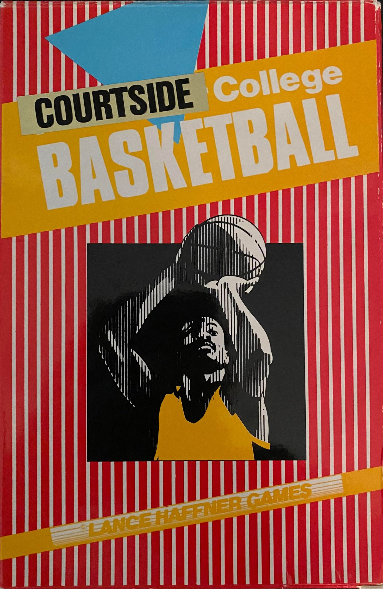

# LH Games Courtside College Basketball

## Game Description
**· Each player contributes as they did in real life! · Stats Compiler · You determine starting lineup, substitutions, shot selection, passing, offensive and defensive styles of play and more! ·**

## About Project
With permission from Lance Haffner himself, this effort is being made to bring his original source code from the DOS world into the modern world. This is due in part to cross-platform compilers for BASIC. But this effort restores his original vision for a cross-platform sports sim empire, also opening the door for any manner of improvements to accuracy and portability.

Several functions from the original code were linked from Crescent Software libraries. To make a faster route to compilation of the code, most of these were re-written as copycats (where code was not available or ASM routines were used). Functions which relied on packing color into 1 byte were updated to use FG/BG separately. This is in anticipation of future work that will aim to reduce as many of these routines as possible

## About LH Games
Since 1983 Lance Haffner Games has been publishing the finest quality text-based computer sports games. Recognized for their statistical accuracy; national media outlets have used Haffner's games to play matchups between great teams of the century. The Ft. Worth Star-Telegram, WTVF-TV (Nashville), The Nashville Banner, and ESPN have used Lance Haffner's games to simulate real and "what if" matchups using current teams and great teams from the past.

LH Games were some of the premier simulators of the 80's. They were a staple of of the mail order days and  served as one of the earliest computer sports simulation. Available for several platforms at the time thanks to their use of BASIC, they fast became known for their impressive accuracy and surprisingly quick speed. Not only that, they allowed very detailed and thorough team, conference and season management - yet somehow maintained an entertaining feel with gameplay that was never overly detailed. 

## Visuals

	
## Installation
No installation required. Pre-compiled binaries and required reference files are in /bin.

## Usage
Run Hello.exe to start with the main game menu.

Teams files will not be included at this time. However, if you're nice enough, the people at the [Haffner Files Facebook group](https://www.facebook.com/groups/183455342454939) will be glad to help you.

## Support
Contact me at my [profile page](https://github.com/jleonard2099/jleonard2099/tree/main) for now.
See future revisions to this for possible links to bug trackers / etc. as they are considered.

## Project Status
Code has been re-worked to compile in a modern environment. Code for menu navigation is completely re-factored, and has been consolidated so it can be supported for Linux / Mac compile in QB64.

Things are moving along as fast as personal time allows for now, which is pretty well now. Anticipate finished product by September 2022. This only involves re-factoring game play code.

# Roadmap
## Phase 1

First work from this point will focus on further code efficiency and cleanup such as:
- Removing extraneous lines and improve flow control (no GOSUB/GOTO)
- Use of color constants for easier visualization of code
- Make wording of menus and options consistent for all products

The following improvements to functionality are also planned:
- Improve handling of required default files
- Improve error handling to catch / provide helpful messages
- Update key input handling / routines (handling Esc vs. Ctrl+C, etc.)

Finally, the first efforts will be made to migrate the project to rely on fewer EXEs by converting supporting files to subroutines.
This will prepare the way forward for cross-platform support.

## Phase 2
This phase will involve these short and simple goals:
- Updating the games to support modern rules
- Bug fixes / etc. as reported by longtime users and playtesters

## Phase 3
This final phase will involve the following:
- Updating code to work with databases instead of flat files.
- Bringing modern interface concepts to the design (including GUI)

# Contributing
Contact me directly if interested in contributing. Only considering people who share my vision for these games and are able to honor Lance's work and legacy.

# Authors / Acknowledgment
- I am responsible for maintaining / updating most of the code and will spend equal effort to code cleanup as to code improvement.
- Jason Lamb, for lending his expertise in BASIC to helping me learn some standards and rewriting the menu functions.
- Lance Haffner, for his hard work over 2 decades giving people endless hours of playable sports games and making dreams come true.
- [Lance Haffner Sports Sims](https://www.facebook.com/groups/115923978469802) Facebook group admin Philip Lupi, for his hard work keeping Lance's games alive and active with fans old and new.
- [Manual images created by Cool Clips](http://search.coolclips.com/)
- [Game icons created by Joseph Gan (Icon-Icons)](https://icon-icons.com/users/XHgnBHIfJk0ZlajSy0A0x/icon-sets/)
- [Basketball-court icons created by Freepik - Flaticon](https://www.flaticon.com/free-icons/basketball-court)

# License
Affero GNU GPL v3
